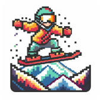
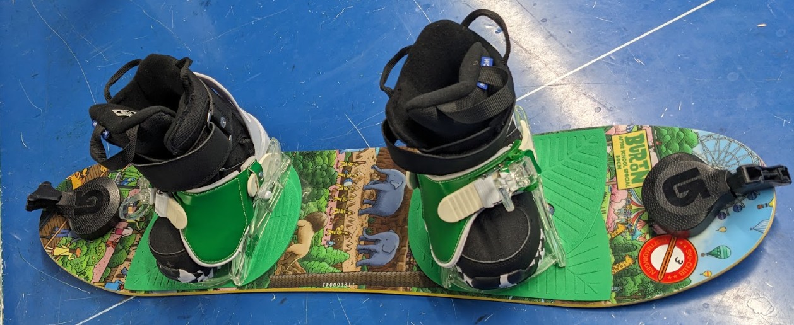
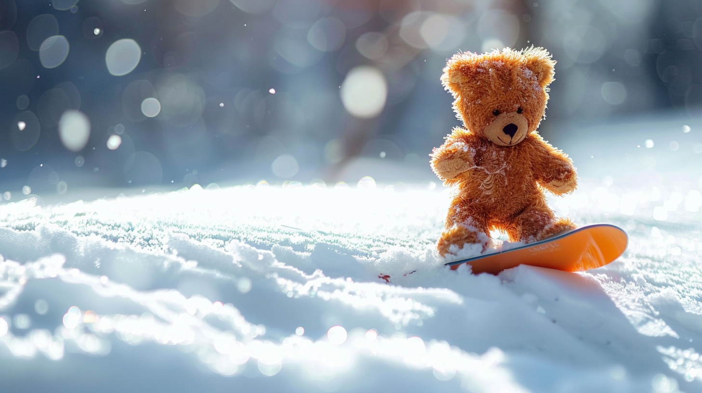
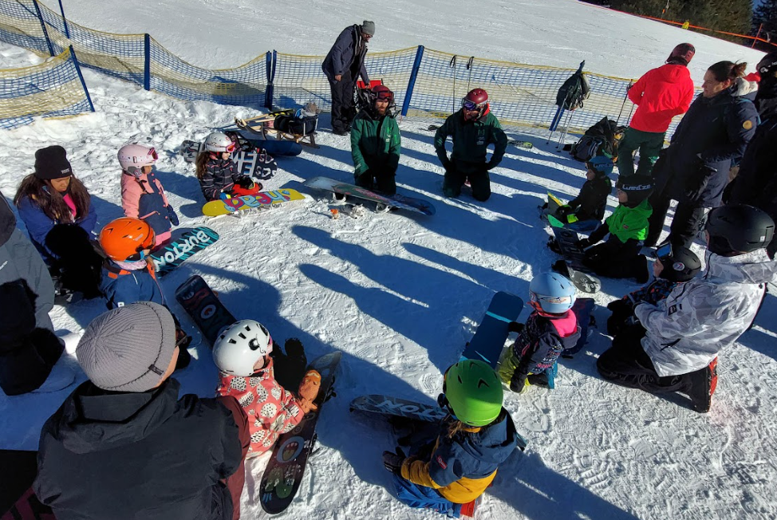

# Einleitung

-   Dieser Leitfaden richtet sich an Snowboardlehrer und Verantwortliche in örtlichen Skivereinen, die Snowboardkurse für Kinder im Alter von 4 bis 7 Jahren anbieten möchten. Er umfasst wichtige Aspekte wie den Ablauf der Kurse, das erforderliche Material, die pädagogischen Ziele sowie spezifische Übungen und Rituale, die für eine erfolgreiche und spaßige Einführung der Kinder in den Wintersport sorgen sollen.

-   

## Allgemeine Informationen

Hier siehst du ein Beispiel für die Struktur und Organisation eines beispielhaften Snowboard-Kurses für Kinder:

- **Kosten:** 60€ für Mitglieder, 80€ für Nichtmitglieder
- **Kursdauer:** 2 Wochenenden (Samstag/Sonntag) von 10:00 bis 15:00 Uhr mit vielen Pausen
- **Alter:** 4 bis 7 Jahre
- **Materialverleih:** 10€/Tag oder 60€/Saison durch den Skiclub
- **Betreuung:** Ein Elternteil muss als 1:1 Betreuung teilnehmen
- **Identifikation:** Eisi-Buttons für die Skibrille

## Material

-	Wie bei den „normalen“ Anfängern auch sollte das Snowboard bis ca. Kinnhöhe gehen
-	Eine Neuanschaffung wird bei den meisten Eltern kein Thema sein, Neupreis für ein komplettes Set liegt bei ca. 400€. Daher muss es möglich sein Material zu mieten
-	Burton bietet passende Sets ab 80 cm mit Riglets (Seilzug) an, Saisonpreis 159€. Eventuell Kooperation mit Fuhrer OG (Burton) oder Sport Kern Seebach (Nitro). Vorteil von Riglets gegenüber Ziehen mit Ringen ist das freie Stehen auf dem Brett, dadurch wird das Gleichgewicht der Kids besser geschult
-	Der Skiverband Schwarzwald vermietet bis zu 5 Sets → Muss allerdings in Freiburg abgeholt werden
-	Alternativ kann man beim Schwäbischen Skiverband das Material stark vergünstigt über den Verein kaufen und selbst vermieten (Ausrüstung | Online-Shop des Schwäbischen Skiverbandes e.V. (online-ssv.de)) Bei 60 € / Saison wäre der ROI nach ca. 3 Jahren.
-	Weitere Alternative wäre es das Material gebraucht zu kaufen, z.B. eBay Kleinanzeigen oder facebook Gruppen (z.B. „boardermäuse“).

## Ziele des Kurses

Die pädagogischen Ziele des Kurses konzentrieren sich auf den Spaß am Wintersport sowie auf erste grundlegende Fähigkeiten, ohne dabei zu früh komplexere Techniken einzuführen.

- **Hauptziel:** Spaß am Wintersport wecken
- **Fertigkeiten:** Fahren in der Falllinie, Backside schräg rutschen
- **Keine Ziele:** Kurvenfahren/Umkanten, Frontside fahren außer mit Hilfestellung

## Rituale

Rituale spielen eine wesentliche Rolle im Lernprozess der Kinder und helfen, eine positive und unterstützende Lernumgebung zu schaffen.

**Beispiele**: Einsatz eines Maskottchens, festgelegte Rituale wie Begrüßungslied, Pausen und Abschlussrituale.

## Ablauf Tag 1

Wenn die Luft kalt ist und der Schnee unter den Boots knirscht, dann ist es Zeit für die kleinen Pistenabenteurer, ihren ersten Tag im Snowboardkurs zu beginnen. Hier ist ein Einblick in den Ablauf, damit die ersten Berührungen mit dem Schnee und dem Board so einfach wie möglich werden.

**Begrüßung im Kreis:** Der Tag startet mit einer fröhlichen Runde, wo jeder jeden kennenlernt. Es wird gesungen oder eine Musikbox sorgt für die ersten lächelnden Gesichter. Ein toller Weg, um eine entspannte und freundschaftliche Atmosphäre zu schaffen.

**Hallo Eisi!:** Dann ist es Zeit für Eisi, das Maskottchen, die Bühne zu betreten. Eisi ist nicht nur da, um die Stimmung zu heben, sondern auch um den Kids ein Gefühl von Sicherheit zu geben. Mit Eisi an ihrer Seite ist der Schnee nur halb so kalt und die Piste nur halb so steil.

**Aufwärmrunde:** Bevor es aufs Board geht, wird sich gemeinsam warmgemacht. Das kann über lustige Spiele passieren, bei denen man vor imaginären Haien flüchtet oder von Eisscholle zu Eisscholle hüpft. Dann gibt's ein Stretching im Kreis, um die Muskeln auf das bevorstehende Abenteuer vorzubereiten.

**Material-Check:** Jetzt wird's ernst – es geht ums Board. Die Kids lernen, dass die Bindungen auf der Piste fest sein müssen, während die Unterseite rutschig bleibt, damit das Gleiten klappt. Sie lernen die Teile ihres neuen besten Freundes kennen: Nose, Tail, Frontside, Backside, Strap und Highback.

**Board tragen wie ein Pro:** Bevor man auf dem Board steht, muss man es tragen können. Die kleinen Shredder üben, das Board geschickt unter der Bindung zu halten und dabei eng zusammen zu laufen – ohne sich oder das Board zu touchieren. Und das bitte auf beiden Seiten!

**Anschnallen für Anfänger:** Auf Antirutschmatten geht's los mit dem vorderen Fuß. Die kleinen Boarder lernen, das Brett auf die Kante zu stellen, indem sie Zehen und Ferse benutzen, und das Brett mal nach vorne, mal nach hinten zu bewegen.

**Jetzt kommen beide Beine dran:** Mit beiden Füßen angeschnallt, helfen die Eltern beim Aufkanten. Die Kids spüren die Nose und das Tail, indem sie die Vorlage und Rücklage üben. Einmal in die Knie und wieder hoch – so fühlt sich das Board-Leben an!

**Und dann das erste Rutschen:** Mit einem Fuß noch frei, lassen sich die Kleinen von den Eltern ziehen – wie beim Spiel "Die Acht". Sie üben, das Board zu steuern und zwischendurch gibt es eine kleine Rollerfahr-Einheit.

All diese Schritte sind wichtige Bausteine für den großen Moment: Wenn beide Füße festgeschnallt sind und die ersten eigenständigen Rutschversuche auf dem Schnee gemacht werden. Es ist ein Tag voller neuer Eindrücke, voller Lachen und vielleicht dem einen oder anderen kleinen Sturz. Aber vor allem ist es ein Tag, der den Kids zeigt, dass sie mit Mut und der richtigen Anleitung alles erreichen können – sogar das Snowboardfahren.

